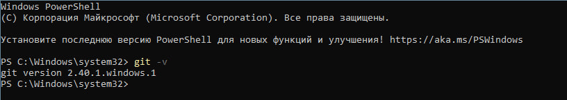
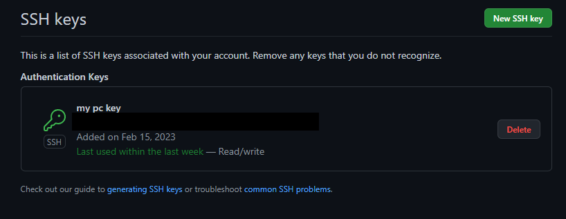
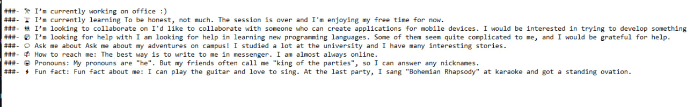
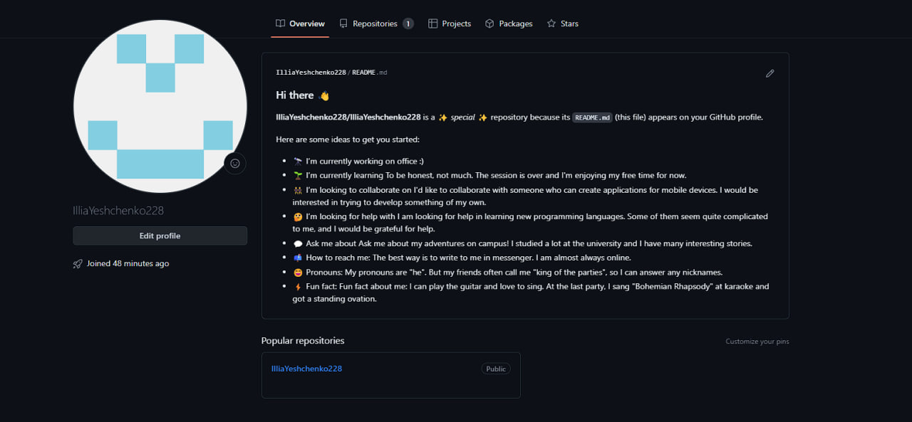

# Мета роботи

Розібрати принципи та базові команди для роботи з git. Створити опис для свого акаунта GitHub.

# Хід роботи

1. Створити обліковий запис GitHub


2. Встановити CHOCOLATEY за допомогою powershell:
```
Set-ExecutionPolicy Bypass -Scope Process -Force; [System.Net.ServicePointManager]::SecurityProtocol = [System.Net.ServicePointManager]::SecurityProtocol -bor 3072; iex ((New-Object System.Net.WebClient).DownloadString('https://chocolatey.org/install.ps1'))
```


3. Встановити git на комп'ютер за допомогою Chocolatey:
```
choco install git -y
```
Перевіряємо правильність установки. Для цього дізнаємось версію встановленого гіт.



4. Налаштувати гіт за своїми даними:
```
git config --global user.name "MykolaOverko"
git config --global user.email m.v.overko@student.khai.edu
```

5. Згенерувати новий SSH ключ:
```
ssh-keygen -t ed25519 -C "m.v.overko@student.khai.edu"
```

Ключ було згенеровано за шляхом "C:\Users\User\.ssh" у файлі id_ed25519.pub

6. Додати ключ до облікового запису Github:



7. Створити новий репозиторій з назвою такою ж як і назва акаунту:


8. Склонувати репозиторій за допомогою git clone на локальний пк та відредагувати README.md:



9. Завантажити опис профілю:
```
git add .
git commit -m "Add your comment"
git push
```



Висновок

Після виконання лабораторної роботи було здобуто знання щодо використання git та GitHub. Засвоєно принципи роботи з репозиторіями та необхідні дії для зміни, додання або видалення файлів з них. Розглянуто форматування тексту для файлу README.md.
